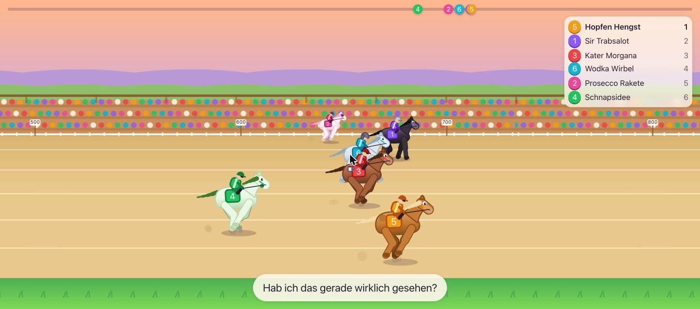
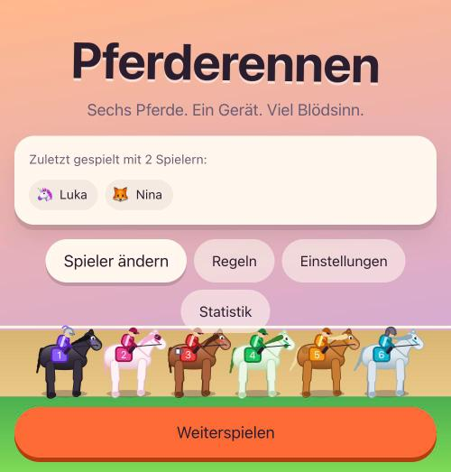
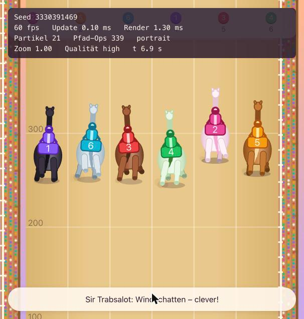

# 🐎 Pferderennen – das Trinkspiel

Sechs Cartoon-Pferde, eine Bahn voller Blödsinn und deine Freunde, die auf das falsche Pferd setzen.
Browser-Spiel für einen Abend am Küchentisch: ein Gerät, alle schauen zu.

**▶︎ Spielen: [lukabpunkt.github.io/Pferderennen](https://lukabpunkt.github.io/Pferderennen/)**

Kein Download, kein Konto, kein Server. Einmal geladen läuft es offline weiter – und auf dem Handy
lässt es sich über „Zum Home-Bildschirm hinzufügen" wie eine App installieren.



<p align="center">
  
  
</p>

## Regeln in 5 Zeilen

1. Jeder wählt eins der sechs Pferde und setzt 1–10 Schlücke.
2. Die Pferde rennen. Es passiert Unfug (Bananenschalen, Kotzpausen, Regenbogen-Fürze).
3. Wer aufs Siegerpferd gesetzt hat, **verteilt** seine Schlücke.
4. Alle anderen **trinken** ihren Einsatz.
5. Nächstes Rennen.

Hat niemand aufs Siegerpferd gesetzt, gewinnt das Haus – dann trinken alle ihren Einsatz.

## Ist das fair?

Ja, und zwar bewiesen: **1.000.000 simulierte Rennen, größte Abweichung 0,0006 vom idealen 1/6.**

| Was geprüft wird | Ergebnis über eine Million Rennen |
| --- | --- |
| Siege je Pferd | 0,1662 – 0,1673 (ideal: 0,16667) · χ² = 4,49, p = 0,48 |
| Siege je **Bahn** | 0,1663 – 0,1671 · χ² = 3,08, p = 0,69 |
| Plätze 2 bis 6 | ebenfalls gleichverteilt |
| Events je Pferd | gleichverteilt, nie mehr als zwei je Läufer |

Alle sechs Pferde sind spielmechanisch **identisch**. Es gibt keine Stats, keinen „Speed"-Wert,
keinen Glücksfaktor – Name, Farbe und Charakter sind reine Kosmetik. Auch die Bahn spielt keine
Rolle, und nichts, was ein Spieler tut, beeinflusst das Ergebnis.

Spannend ist es trotzdem, und auch das wird gemessen: Der Führende zur Rennhälfte gewinnt nur in
**31 %** der Fälle, es gibt im Schnitt **11,9 Führungswechsel** pro Rennen, und **40 %** der Rennen
enden im Fotofinish.

Der Audit läuft bei **jedem Commit** in der CI und ist ein Pflicht-Gate: Kein Deploy, wenn er rot
ist. Voller Bericht: [`docs/audits/fairness-v1.0.json`](./docs/audits/fairness-v1.0.json) ·
Wie die Engine das macht: [`docs/03_RACE_ENGINE.md`](./docs/03_RACE_ENGINE.md) ·
Release-Nachweis: [`docs/audits/release-v1.0.md`](./docs/audits/release-v1.0.md)

## Die Pferde

|     | Pferd           | Farbe     | Charakter (nur Flavor)                 |
| --- | --------------- | --------- | -------------------------------------- |
| 1   | Sir Trabsalot   | Lila      | Edel, hochnäsig, hält sich für Adel     |
| 2   | Prosecco Rakete | Pink      | Party-Pferd, laut, immer gut drauf      |
| 3   | Kater Morgana   | Rot       | Verkatert, mal Turbo, mal Koma          |
| 4   | Schnapsidee     | Grün      | Chaotisch, macht unverständliche Dinge  |
| 5   | Hopfen Hengst   | Bernstein | Gemütlich, bayrisch, kraftvoll          |
| 6   | Wodka Wirbel    | Eisblau   | Kalt, effizient, nervös zuckend         |

## Einstellungen

| Einstellung             | Auswahl                                          | Standard |
| ----------------------- | ------------------------------------------------ | -------- |
| Renndauer               | Kurz / Normal / Lang (≈ 20 / 30 / 45 s)          | Normal   |
| Chaos-Level             | Ruhig / Normal / Vollgas                          | Normal   |
| Wettart                 | Sieg / Platz / Letzter / Frei wählbar pro Spieler | Sieg     |
| Event-Trinkregeln       | An / Aus                                          | An       |
| Führungswechsel-Regel   | An / Aus                                          | Aus      |
| Sound                   | An / Aus                                          | An       |
| Vibration               | An / Aus                                          | An       |
| **Alkoholfrei-Modus**   | An / Aus – aus Schlücken werden Punkte            | Aus      |
| Reduzierte Bewegung     | Automatisch / An / Aus                            | Auto     |

## Lokal starten

```bash
npm install
npm run dev
```

Dann `http://localhost:5173` öffnen (im WLAN auch vom Handy über die IP, die `npm run dev` ausgibt).

| Befehl                   | Wozu                                                                 |
| ------------------------ | -------------------------------------------------------------------- |
| `npm run dev`            | Dev-Server mit Live-Reload (Vite, nur als Static Server)              |
| `npm run serve`          | Derselbe Ordner ohne jede Abhängigkeit – so läuft es auf Pages        |
| `npm test`               | Unit-Tests (Vitest) – 315 Stück                                       |
| `npm run e2e`            | End-to-End-Tests (Playwright, Chromium + WebKit im Handy-Viewport)    |
| `npm run audit:fairness` | Rennen headless simulieren und statistisch prüfen                     |
| `npm run icons`          | PWA-Icons aus dem Pferdekopf des Spiels neu rendern                   |
| `npm run sw`             | Precache-Liste des Service Workers neu schreiben                      |
| `npm run lint`           | ESLint + Prettier prüfen                                              |
| `npm run format`         | Prettier schreiben                                                    |

Nützliche URL-Schalter: `?debug=1` (Seed, FPS, Tastenkürzel), `?seed=123` (dasselbe Rennen
reproduzieren), `?debugSkip=1` (Überspringen-Knopf).

## Tech

Vanilla JavaScript (ES Modules), HTML5 Canvas 2D, kein Framework, kein Bundler, **kein
Build-Schritt**. Was im Repo liegt, ist genau das, was der Browser lädt. Zur Laufzeit gibt es
keine einzige Abhängigkeit: Auch der Ton ist synthetisiert (Web Audio, keine Audiodateien) und die
Icons werden aus dem Zeichencode des Spiels gerendert.

Die Simulation in `src/engine/` ist bei gegebenem Seed vollständig deterministisch und hat keinen
Zugriff auf DOM, Canvas oder `Math.random` – ESLint erzwingt das. Nur deshalb lässt sich Fairness
überhaupt beweisen.

## Projektplan

| Dokument                                                | Inhalt                                       |
| ------------------------------------------------------- | -------------------------------------------- |
| [`docs/01_GAME_DESIGN.md`](./docs/01_GAME_DESIGN.md)     | Regeln, Pferde, Ablauf, Event-Katalog        |
| [`docs/02_ARCHITECTURE.md`](./docs/02_ARCHITECTURE.md)   | Module, State Machine, Datenmodell           |
| [`docs/03_RACE_ENGINE.md`](./docs/03_RACE_ENGINE.md)     | Simulation, Zufall und der Fairness-Nachweis |
| [`docs/04_DESIGN_SYSTEM.md`](./docs/04_DESIGN_SYSTEM.md) | Farben, Typografie, Animation, Screens       |
| [`docs/05_MILESTONES.md`](./docs/05_MILESTONES.md)       | Arbeitsplan M0–M9                            |
| [`docs/06_QA_AUDITS.md`](./docs/06_QA_AUDITS.md)         | Audit-Checklisten A0–A7                      |
| [`docs/07_DEPLOYMENT.md`](./docs/07_DEPLOYMENT.md)       | Git-Workflow, CI, GitHub Pages               |
| [`PROGRESS.md`](./PROGRESS.md)                           | Fortschritt, Audit-Protokolle, Entscheidungen |
| [`CHANGELOG.md`](./CHANGELOG.md)                         | Was in welcher Version dazukam               |

## Verantwortung

Trinkt verantwortungsvoll. Wasser ist auch ein Getränk. Wer fährt, spielt im Alkoholfrei-Modus um
Punkte – der macht genauso viel Spaß.

## Lizenz

MIT
